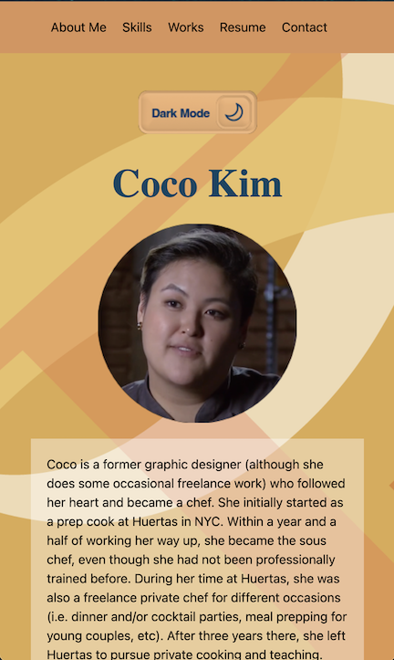

<h1><a href="https://coco-portofolio.netlify.app/">Coco Kim's Portfolio</a></h1>

This is Coco Kim's Portfolio. There are five sections:
<li>About Me</li>
<li>Skills</li>
<li>Works</li>
<li>Resume</li>
<li>Contact</li>

<a href="https://trello.com/b/5mpfxGSs/cocos-portfolio">Trello</a>
<a href="https://whimsical.com/coco-s-portfolio-7hheCgZWbEan5h9Uk97G9R">Wireframe</a>

<h2>Technologies Used</h2>
<li>CSS</li>
<li>Javascript</li>
<li>HTML</li>
<li>Contact</li>
<li>Bootstrap</li>

